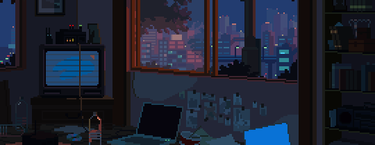

# Hey there! I'm Mathieu "okzmo" Rossi. 

While I can't qualify as a SWE (no diploma), I don't think I fall short when it comes to actually doing the work. I'm mostly self-taught and I've been learning as much as I can for the past 2-3 years, with a focus on web development since that's the first field I ever encountered. Now I try to get involved in other fields I can reasonably understand and I'm mostly having fun.

## What's keeping you busy these days?

- Breaking free from the "web-only developer" stereotype by diving in other fields. Networking has particularly caught my eye - it's the first non-web domain that's truly grabbed my attention. Also eyeing game UI development (soon™).
- Crafting NOSYNC, my take on a personal knowledge management system (think mymind, but with my own twist on UI and features).

## What's next on the horizon?

- Building cool stuff that matters (or at least entertains me).
- Continuously learning and growing (that's the most generic sentence I've ever wrote).

### How can I contact you?

- [LinkedIn](https://www.linkedin.com/in/mathieu-rossi-dev).
